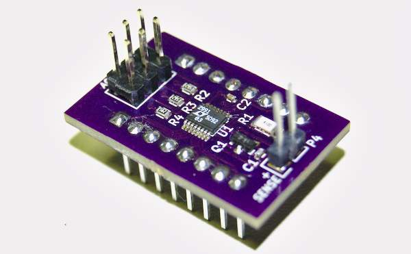
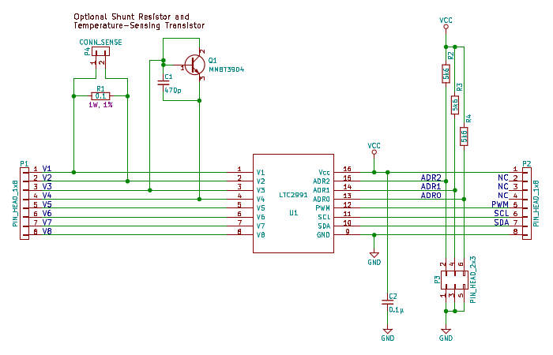

LTC2991 Development Board
=========================

A simple printed circuit board that makes it easy to plug the
surface-mount (MSOP-16) `LTC2991`_ into a common breadboard.

.. _LTC2991: http://www.linear.com/product/LTC2991

   A fully-assembled LTC2991 breakout board, ready for service.

Features
--------

* A pair of pin headers for each of the LTC2991's address lines.
  Jumpering the pins on any given address line connects that line to
  ground.
* Pads suitable for a current-sensing shunt resistor (1206 SMD),
  connected across the V1 and V2 terminals of the LTC2991, and pads
  for a 1x2 pin header to connect said shunt to the outside world.
* Pads suitable for a temperature-sensing, diode-connected NPN BJT
  (SOT-23 SMD), connected across the V3 and V4 terminals of the
  LTC2991, and a filter capactitor for said transistor.

   Carrier board schematic.  Click for PDF.

Caveats
-------

There seems to be no such thing as a breadboard standard.  This PCB
was designed to work with an `R.S.R.-branded breadboard`_.  It
features a 0.100" pin pitch, and an approx. 0.300" gap down the middle
of the board.

.. _R.S.R.-branded breadboard: http://rsrelectronics.com/breadboards.html

Changelog
---------

Rev. A
~~~~~~
Initial design.

Rev. B
~~~~~~
* Added two-pin header for measurement of external current source
  via on-board shunt resistor (both optional).
* Added filter capacitor for IC power.
* Added filter capacitor for temperature-sensing transistor (both
  optional).
* Placed noise-shielding traces around temperature-sensing
  transistor.
